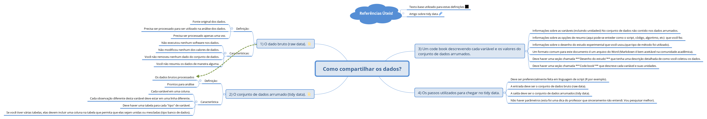
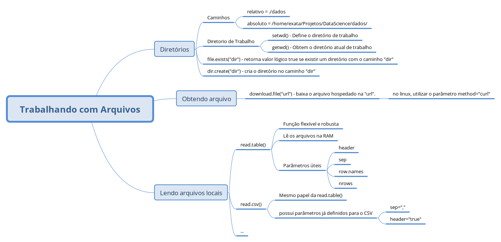
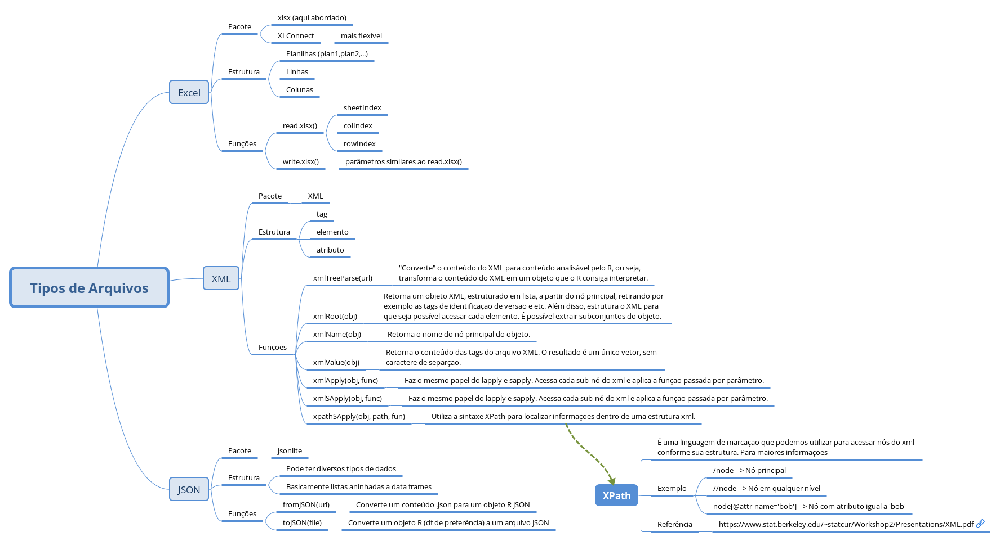
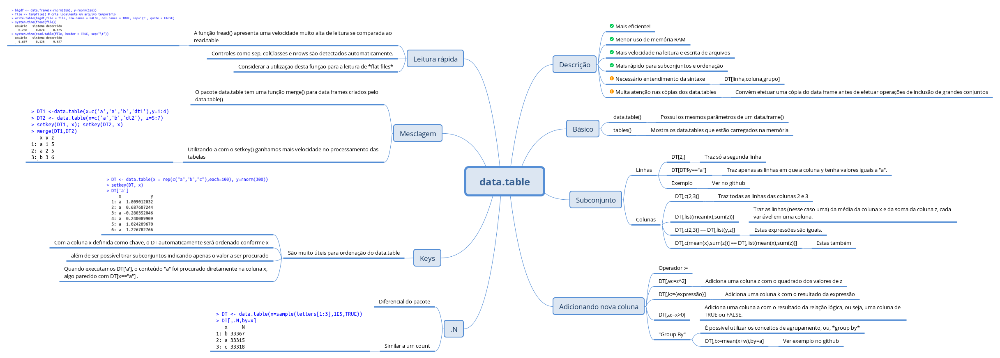

# Índice

# Notas de Aula [Semana 1]

Observação: A grande maioria dos exemplos aqui expostos foram extraídos dos cursos do Coursera ou do repositório dos conteúdos https://github.com/DataScienceSpecialization/courses/tree/master/03_GettingData

## Raw Data (dados brutos)

O *raw data* é basicamente o dado bruto, "direto do forno", o que significa que ele não passou por nenhum processamento prévio, nem por nenhum software que possa ter alterado algum dado, nenhum dado foi movido entre colunas e nenhum script de limpeza foi executado. Ou seja, o dado definitivamente **bruto**, necessitando de lapidação.

Essas são simples caracteristicas de um *raw data*.

## Tidy Data (dados arrumados)

É a próxima etapa dos dados brutos, aqui o **raw data** foi processado e o(s) conjunto(s) resultante(s) já estão prontos para análise. *Tidy Data* possui um [*paper*](http://vita.had.co.nz/papers/tidy-data.pdf) bem conhecido no meio da análise de dados que tras definições mais precisas sobre o seu "estado".

[Define-se](https://github.com/jtleek/datasharing#the-tidy-data-set) que, o tidy data precisa ter algumas características:

* Cada variável em uma coluna.
* Cada observação diferente desta variável deve estar em uma linha diferente.
* Deve haver uma tabela para cada "tipo" de variável.
* Se você tiver várias tabelas, elas devem incluir uma coluna na tabela que permita que elas sejam unidas ou mescladas (tipo banco de dados).

## Code Book

Um *code book* possui todos as descrições sobre os dados em que trabalhamos. Nele por exemplo, possui descrições como as variáveis e suas unidades, métodos utilizados para obtenção de algum resultado, scripts utilizados, etc.

*Cabe neste tópico uma melhor abordagem já que precisaremos de um code book para o projeto final deste curso. Vamos alimentando-o com o decorrer do curso*

## Passos até chegar ao resultado da análise

Descreve-se como chegamos ao *tidy data*. Para o nosso caso, **Deve ser preferencialmente feita em linguagem de script (R por exemplo)**, que deve ter como entrada o raw data e como saída o tidy data. Nestas descrições deve-se informar também passos adicionais necessários, por exemplo: salvar o arquivo x na pasta yx, utilizar o algoritmo de versão 3.2.1, etc.

Estes tópicos, na sequência em que apareceram, formam um "boas-práticas" no envio de dados à um estatístico, além de ser uma forma bem aceita quando se divulga uma análise de dados.

Referência: https://github.com/jtleek/datasharing

Mapa mental resultante desta aula

## Trabalhando com pastas

Como trabalhamos com muitos arquivos, locais ou na web, precisamos de um diretório de trabalho para seguirmos com as devidas manipulações.

Para definir um diretório de trabalho utilizamos a função `setwd("path")`, onde *path* pode ser o **caminho absoluto** da pasta (/home/exata/DataScience/dados") ou o **caminho relativo** a partir do diretório atual (./DataScience/dados).
Convém, ao trabalhar com scripts criarão automáticamente a pasta, verificar se a pasta a ser criada já existe:

    if(!file.exists("./data"){
        dir.create("data")
    }
    ....

## Lendo arquivos

### Arquivos _flat_

Na grande maioria das vezes trabalha-se, localmente, com arquivos de estrutura simples, conhecidos como [flat files](http://www.revistabw.com.br/revistabw/flat-file/). CSV é um exemplo de *flat file*.

Podemos usar a função `read.table()` para ler este tipo de arquivo. Esta função é muito poderosa pois possui diversos parâmetros que podem otimizar o processo de leitura. Por exemplo:

* `header`: valor lógico, diz se o a primeira linha do arquivo corresponde ao cabeçalho.
* `sep`: string, informa qual o caractere que separa as colunas.
* `nrows`: inteiro, quantas linhas deseja ler do arquivo?
* `skip`: inteiro, quantas linhas deseja pular, a partir da primeira, do arquivo?
* diversos outros parâmetros, ver `help()` da função.

Além desta função temos também a `read.csv()` que possui é basicamente a mesma função porém com os parâmetros `header=TRUE` e `sep=","`.

### Arquivos xlsx (Excel)

**Pacote**: xlsx ou XLConnect

Os arquivos em excel podem ser lidos baseado em sua estrutura: planilha, linha e coluna.

Com o pacote xlsx temos:
* `read.xlsx()` - Lê o arquivo em excel,
    * `sheetIndex`: inteiro, em qual "Planilha" ler,
    * `colIndex`: inteiro, coluna(s) a ler,
    * `rowIndex`: inteiro, linha(s) a ler,
* `write.xlsx()` - Escreve o arquivo em excel, utiliza parametros similar.
* `read.xlsx2()` - Parece ser melhor que o `read.xlsx()`, mas apresenta instabilidade na leitura de subconjuntos.

### Arquivos XML

**Pacote**: XML

Os arquivos XML, muito utilizado em aplicações Web, podem ser lidos baseado em sua estrutura: etiqueta, atributo e conteúdo:

Funções básicas e de grande utilidade no pacote XML:

* `xmlTreeParse(file)` - "converte" o conteúdo do XML para conteúdo analisável pelo R, ou seja, transforma o conteúdo do XML em um objeto que o R consiga interpretar.
* `htmlTreeParse(url)`: "converte" o conteúdo do HTML para conteúdo analisável pelo R, ou seja, transforma o conteúdo do XML em um objeto que o R consiga interpretar.
* `xmlRoot(obj)` - retorna um objeto XML, estruturado em lista, a partir do nó principal, retirando por exemplo as tags de identificação de versão e etc. Além disso, estrutura o XML para que seja possível acessar cada elemento. É possível extrair subconjuntos do objeto.
* `xmlName(obj)` - retorna o nome do nó principal do objeto.
* `xmlValue(obj)` - retorna o conteúdo das tags do arquivo XML. O resultado é um único vetor, sem caractere de separção.
* `xmlApply(obj, func)` - Faz o mesmo papel do lapply e sapply. Acessa cada sub-nó do xml e aplica a função passada por parâmetro.
* `xmlSApply(obj, func)` - Faz o mesmo papel do lapply e sapply. Acessa cada sub-nó do xml e aplica a função passada por parâmetro.
* `xpathSApply(obj, path, fun)` - Utiliza a sintaxe XPath para localizar informações dentro de uma estrutura xml.

#### XPath

Cabe aqui uma menção ao XPath, uma linguagem de marcação a ser utilizada com XML. Para maiores informações, ler esta [publicação](https://www.stat.berkeley.edu/~statcur/Workshop2/Presentations/XML.pdf) recomendada.

### Arquivos JSON

**Pacote**: jsonlite

Os arquivos JSON são bastante utilizado em API. Sua estrutura pode receber qualquer tipo de valor.

Funções básicas:

* `fromJSON(url)` - retorna um objeto JSON a partir de uma url ou arquivo no formato json.
* `toJSON(url)` - converte um arquivo do tipo data.frame e um arquivo json.

## Pacote `data.table`

Próprio para data frames (funções que usam data.frame trabalham bem com data.table), mais eficiente comparado as funções read.* e rápido na extração de subconjuntos.

* `data.table()` possui os mesmos parâmetros da função `data.frame()`
* `tables()` traz informações sobre as tabelas (data.table) carregadas na memória.

A estrutura de um data.table é basicamente DT[linha,coluna,*group by*]

### Subconjuntos de linhas

* `DT[2,]` - traz só a segunda linha
* `DT[DT$y=="a"]`- traz apenas as **linhas** em que a coluna y tenha valores iguais a "a".

**Observação importante**: Quando você está extraindo subconjuntos por índice, ou seja, `DT[y]`, o resultado é a **linha** correspondente a y. Ao contrário do data.frame em que o y corresponderia a coluna. Exemplo
    
    > DT[c(2,3)]
            x y          z
    1:  0.2717048 a -2.9952037
    2: -0.1211096 a  0.2650059
    > DF[c(2,3)]
    y           z
    1 a  0.12056471
    2 a  0.67534778
    3 a -0.79977420
    4 b -0.56572865
    5 b  2.23589244
    6 b -0.93204517
    7 c  0.76105567
    8 c -0.74887635
    9 c -0.05775674
    
### Subconjuntos de colunas

Pode ser realizado normalmente com índices:
* `DT[,c(2,3)]` - traz todas as linhas das colunas 2 e 3

Pode ser realizada com expressões em lista

* `DT[,list(mean(x),sum(z))]` traz as linhas (nesse caso uma) da média da coluna x e da soma da coluna z, cada variável em uma coluna.
* `DT[,c(2,3)] == DT[,list(y,z)]` Estas expressões são iguais.
* `DT[,c(mean(x),sum(z))] == DT[,list(mean(x),sum(z))]` Estas também.

### Adicionando nova coluna

Utilizar o operador `:=`

* `DT[,w:=z^2]` - Adiciona uma coluna z com o quadrado dos valores de z
* `DT[,k:={expressão}]` - adiciona uma coluna k com o resultado da expressão
* `DT[,a:=x>0]` - Adiciona uma coluna a com o resultado da relação lógica, ou seja, uma coluna de `TRUE` ou `FALSE`.

Convém efetuar uma cópia do data frame antes de efetuar operações de inclusão de grandes conjuntos

É possivel utilizar os conceitos de agrupamento, ou, *group by*

Utilizando a última expressão acima, podemos usar os resultados TRUE para adicionar determinado valor para cada registro. Exemplo:

* `DT[,b:=mean(x+w),by=a]` - Cria uma coluna b e se a for TRUE será inserido o valor da expressão `mean(x+w)` corresponde a sua linha, senão o resultado da expressão será o da coluna inteira, exemplo:

    > DT[,b:=mean(x+w),by=a]
    > DT
                x y          z          w     a         b
    1:  0.70869743 a  1.4576310 2.12468809  TRUE 3.3429836
    2:  0.27170480 a -2.9952037 8.97124527  TRUE 3.3429836
    3: -0.12110964 a  0.2650059 0.07022815 FALSE 0.7417882
    4:  0.03489042 b -1.1522620 1.32770771  TRUE 3.3429836
    5: -0.58378854 b -0.1124435 0.01264355 FALSE 0.7417882
    6: -1.24286800 b -1.4060055 1.97685142 FALSE 0.7417882
    7:  1.63823503 c -0.9293408 0.86367428  TRUE 3.3429836
    8: -0.82632338 c -1.9187285 3.68151917 FALSE 0.7417882
    9:  0.15564243 c -0.7864049 0.61843260  TRUE 3.3429836

### Variáveis especiais

**.N**, utilizado para contagens. Este é um um dos diferencias do pacote data.table.

Exemplo:

    > DT <- data.table(x=sample(letters[1:3],1E5,TRUE))
    > DT[,.N,by=x]
    x     N
    1: c 33028
    2: b 33114
    3: a 33858
    
Criamos um data frame com 100000 registros e rapidamente, utilizando o **.N** conseguimos a contagem de quantas vezes cada valor é encontrado no conjunto de dados. É basicamente um *count* de outras linguagens, porém muito eficiente em R.

### Definição de chaves

_Keys_ (chaves) são muito úteis para ordenação do data.table. 

    > DT <- data.table(x = rep(c("a","b","c"),each=100), y=rnorm(300))
    > setkey(DT, x)
    > DT['a']
        x           y
    1: a  0.24976171
    2: a -0.73185291
    3: a  0.27755953
    4: a  0.35010287
    5: a  0.39267864
    6: a -0.38501910

Com a coluna x definida como chave, o DT automaticamente será ordenado conforme x, além de ser possível tirar subconjuntos indicando apenas o valor a ser procurado. Quando executamos `DT['a']`, o conteúdo "a" foi procurado diretamente na coluna x, algo parecido com `DT[x=="a"]` .

### Mesclagem

O pacote data.table tem uma função `merge()` para data frames criados pelo `data.table()`. Utilizando-a com o `setkey()` ganhamos mais velocidade no processamento das tabelas. 

Exemplo:

    > DT1 <-data.table(x=c('a','a','b','dt1'),y=1:4)
    > DT2 <- data.table(x=c('a','b','dt2'), z=5:7)
    > setkey(DT1, x); setkey(DT2, x)
    > merge(DT1,DT2)
       x y z
    1: a 1 5
    2: a 2 5
    3: b 3 6
    
## Leitura rápida

A função `fread()` apresenta uma velocidade muito alta de leitura se comparada ao read.table, por exemplo. Segundo sua descrição no arquivo de ajuda, todos os controles como `sep`, `colClasses` e `nrows` são detectados automaticamente.

Em um testes de "tempo" é possível verificar que realmente a leitura é rápida:

    > bigdf <- data.frame(x=rnorm(1E6), y=rnorm(1E6))
    > file <- tempfile() # cria localmente um arquivo temporário 
    > write.table(bigdf,file = file, row.names = FALSE, col.names = TRUE, sep='\t', quote = FALSE)
    > system.time(fread(file))
    usuário   sistema decorrido 
        0.252     0.000     0.069 
    > system.time(read.table(file, header = TRUE, sep="\t"))
    usuário   sistema decorrido 
        5.755     0.000     5.790 
        
Portanto, deve-se considerar a utilização desta função para a leitura de *flat files*.

Conforme citado no curso, o pacote data.table é de grande eficiência quanto a processamento, uso de memória, tempo de resposta, subconjuntos, entre outros. Porém necessita de aprendizagem de sua sintaxe e no funcionamento das cópias de suas data.tables, podendo haver uma curva de aprendizado

# Notas sobre a avaliação:

Respeitando o [Código de Honra do Coursera](https://learner.coursera.help/hc/en-us/articles/209818863) não irei apresentar as respostas dos exercícios, mas anotarei as linhas de pensamentos a serem seguidas (ou não).

## Exercício 1:

*"(...) How many properties are worth $1,000,000 or more?"*

O questionário 1 é bem simples. Pede para **baixarmos** o arquivo que contém dados sobre a habitação de Idaho em 2006 e pede para trazermos **quantas** casas possuem **valor** maior que $ 1.000.000,00. No exercício também é disponibilizado o *data book* deste conjunto de dados.

É interessante neste exercício criarmos um pequeno script, contendo: 1) Validação e criação de uma pasta, 2)Download e gravação do conjunto de dados, 3) Leitura do conjunto de dados, 4) Subconjunto (não necessário, mas válido para aperfeiçoamento), 5) Apresentação do resultado.

Usei o pacote data.table, já que ele não foi apresentado em vão no curso, e foi bem simples retirar o resultado. A dificuldade que pode aparecer é a identificação da variável responsável por guardar os valores ($) das casas. Leia o exercício com atenção.

## Exercício 2:

*"(...)Which of the "tidy data" principles does this variable violate?"*

Esta questão valida se você entendeu bem as definições de *tidy data*. É fácil respondê-la, deve-se apenas prestar atenção ao *code book*

## Exercício 3:

*"(...)What is the value of: `sum(dat$Zip*dat$Ext,na.rm=T)`"*

Inicialmente tive um probleminha com a instalação do pacote xlsx. Consegui resolver graças a esse [post](http://allanino.me/blog/programming/installing-some-r-packages)

Outro exercício sem muito segredo. Basta utilizar a função de leitura do pacote xlsx, definir os parâmetros corretos e pronto.

## Exercício 4:

*"(...) How many restaurants have zipcode 21231?"*

Espero que não tenha ignorado a mensagem que aparece na *lecture* do *Reading XML* em que a maioria dos estudantes precisam voltar na aula para respoder a questão. É verdade, eu fui um deles.

Neste exercício, tenha a sacada de fazer o *parse* do arquivo XML, mais umas coisinhas, e usar o `xpathSApply()`. Esta dica é valiosa.

## Exercício 5:

*"(...)Using the data.table package, which will deliver the fastest user time?"*

Não saia baixando arquivos desnecessariamente. O enunciado nos dá uma dica muuuuuuuuuuuito valiosa. **Usando o pacote data.table**.... Pronto, fácil fácil fácil.
