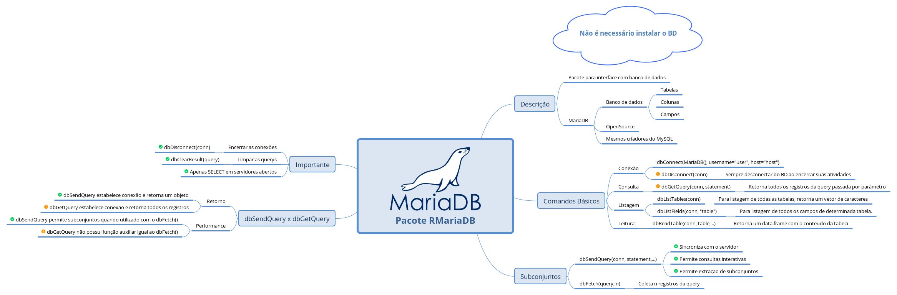
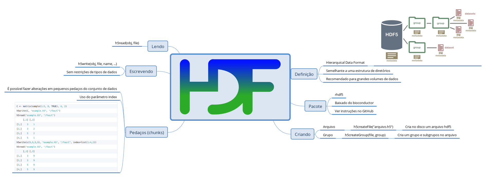
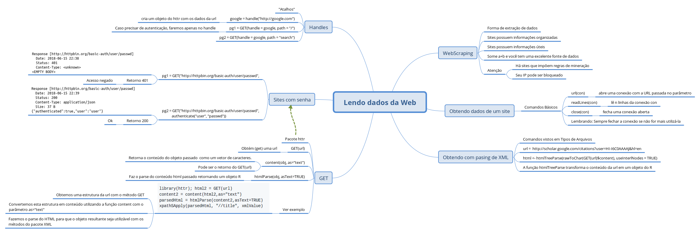

# Notas de Aula [Semana 2]


Observação: A grande maioria dos exemplos aqui expostos foram extraídos dos cursos do Coursera ou do repositório dos conteúdos https://github.com/DataScienceSpecialization/courses/tree/master/03_GettingData

## Lendo de um banco de dados _MySql_

Observação: Irei utilizar o MariaDB.

**Pacote**: [RMariaDB](https://github.com/r-dbi/RMariaDB)

No curso é abordado o MySQL porém optei por utilizar o MariaDB. As sintaxes são basicamente as mesmas, não havendo mudanças nos comandos utilizados na aula.

Um ponto importante é, para esta aula, não é necessário instalar o MySQL pois iremos acessar um servidor remoto. 

No meu caso, precisei instalar uma *cliente library*, conforme explicado no [README](https://github.com/r-dbi/RMariaDB#mysql-client-library) do RMariaDB

### Conectando e listando bases, tabelas e campos

Iremos utilizar o servidor online da UCSC neste [link](http://genome.ucsc.edu/goldenPath/help/mysql.html).

Comandos básicos:
* `dbConnect(drv = MariaDB(), username="genome", host="genome-mysql.cse.ucsc.edu")` - Para estabelecer conexão
* `dbGetQuery(conn, statement)` - Retorna todos os registros da query passada por parâmetro.
 * Observação: o `statement` é uma *string* com um comando SQL.
* `dbDisconnect(conn)` - Desconectar do banco.

É de extrema importância encerrar uma conexão que você não irá mais utilizar.

Lembrando que temos banco de dados -> tabelas -> campos -> registros. No primeiro comando apenas estabelecemos uma conexão com o **servidor** MySQL da UCSC.

* `dbConnect(drv, username, db, host) - Para estabelecer conexão já em uma base
 * Exemplo: `ucscDb <- dbConnect(drv = MariaDB(), username="genome", host="genome-ysql.cse.ucsc.edu")`
* `dbListTables(conn)` - Para listagem de todas as tabelas, retorna um vetor de caracteres.
 * Exemplo: `allTables <- dbListTables(hg19)`
* `dbListFields(db, "tabela") - Para listagem de todos os campos de determinada tabela.
 * Exemplo: `dbListFields(hg19, "affyU133Plus2")`

### Lendo um tabela

* ´dbReadTable(conn, table, ..)´ - Retorna um data.frame com o conteudo da tabela.

### Lendo um subconjunto específico

**Atenção**. Este tópico pode deixar dúvidas.

Para obtermos subconjuntos, utilizamos a função `dbSendQuery(conn, statement,...)`. Então surge a dúvida, qual a diferença entre o dbSendQuery e dbGetQuery?

O `dbGetQuery(conn, statement, ...)` retorna todos os registros existentes na query enviada e salva-o na memória (se associado a alguma variável). Isto pode sobrecarregar a memória do computador caso o conjunto de dados seja grande. Seu retorno é um **data.frame**.

Já o `dbSendQuery(conn, statement, ...)` sincroniza sua query com o servidor de forma que as consultas possam ser realizadas interativamente utilizando o `dbFetch()`. Por exemplo, para trazermos apenas os 10 primeiros resultados de determida `query`, podemos sincronizar com o servidor utilizando o `dbSendQuery(conn, statement = query)` e então enviar o comando de *fetch*:

    dbFetch(query, n=10)

que em SQL seria algo correspondente a `limit 10`.

**Não esquecer de fechar as conexões**

### Considerações

É importante ressaltar que quando acessarmos servidores abertos de banco de dados, usar apenas comandos de consultas (select) e jamais comandos de inserção (insert), atualização (update), mesclagem (join), delete (delete), etc.. Lembre-se, seremos cientistas modernos zelando da reprodutibilidade.
Nestes casos, se necessário manuseamento dos dados, copiá-los a um servidor local.



## Lendo HDF5

**Pacote**:

Descrição:
* Usado para grandes conjuntos de dados.
* Armazena diversos tipos de dados.
* Formato de dados hierarquicos.
* Um data.frame no R pode ser considerado um elemento no HDFs
* Bastante utilizado na genômica.

### O pacote rhdf5

A instalação recomendada é através do [bioconductor](http://bioconductor.org/)

### Funções de criação

* `h5createFile(file)`: Cria no disco um arquivo hdf5.
* `h5createGroup(file, group): Cria um grupo e subgrupos no arquivo.
* `h5ls(file)`: lista os grupos de um arquivo hdf5.

Veja com a estrutura é como a de um grupo de diretórios

```r
created = h5createGroup("example.h5","foo")
created = h5createGroup("example.h5","baa")
created = h5createGroup("example.h5","foo/foobaa")
h5ls("example.h5")

group   name     otype dclass dim
0     /    baa H5I_GROUP           
1     /    foo H5I_GROUP           
2  /foo foobaa H5I_GROUP           
```

### Escrevendo nos grupos

Pode-se utilizar a função `h5write(obj, file, name, ...)`

Alguns exemplos:

```r
A = matrix(1:10,nr=5,nc=2)
h5write(A, "example.h5","foo/A")
B = array(seq(0.1,2.0,by=0.1),dim=c(5,2,2))
attr(B, "scale") <- "liter"
h5write(B, "example.h5","foo/foobaa/B")
h5ls("example.h5")
```

Temos uma matriz, um array, é possível escrever também data.frames compostos:

```r
df = data.frame(1L:5L,seq(0,1,length.out=5),
  c("ab","cde","fghi","a","s"), stringsAsFactors=FALSE)
h5write(df, "example.h5","df")
h5ls("example.h5")
```
### Lendo os dados

A função de leitura é parecida com a de escrita: `h5read(obj, file)`.

### Leitura e escrita em _chunks_ (pedaços) 

Uma das vantagens do arquivo hd5 é que é possível escrever ou ler em "pedaços" por meio do parâmetro `index`. Por exemplo:

```r
C <- matrix(sample(1:5, 8, TRUE), 4, 2)
h5write(C, "example.h5", "/foo/C")
h5read("example.h5", "/foo/C")
     [,1] [,2]
[1,]    3    1
[2,]    3    2
[3,]    5    2
[4,]    5    1
h5write(c(9,9,9,9), "example.h5", "/foo/C", index=list(1:4,2))
h5read("example.h5", "/foo/C")
     [,1] [,2]
[1,]    3    9
[2,]    3    9
[3,]    5    9
[4,]    5    9

```


## Lendo dados da Web

Webscraping: Extrair programaticamente dados dos códigos das páginas de sites.

* Excelente forma de extração de dados.
* Muitos sites possuem informações que você necessita porém não estão disponibilizadas "organizadamente".
* Há sites que impoem regras para mineiração dos dados.
* Leituras em diversas páginas ao mesmo tempo pode bloquear o seu IP.

### Obtendo os dados de sites

* `url(con)`: abre uma conexão com a URL passada no parâmetro
* `readLines(con, n)`: lê n linhas da conexão con.
* `close(con)`: fecha uma conexão aberta

### Obtendo com parsing de XML

Uso identico ao citado no [Arquivos XML](https://github.com/exata0mente/DataScienceCoursera/tree/master/3_GettingAndCleaningData/Semana1#arquivos-xml). 

Primeiro precisamos fazer o Parse do conteúdo e converter em um objeto R. Neste caso, usaremos uma estrutura de HTML ao invés de XML.

```r
url <- "http://scholar.google.com/citations?user=HI-I6C0AAAAJ&hl=en"
html <- htmlTreeParse(url, useInterlNodes = TRUE)
```

Observação: No fórum do Coursera, há uma discussão sobre o não funcionamento desta chamada ao htmlTreeParse. É fornecido então uma solução conforme abaixo:

```r
library(httr)
html <- htmlTreeParse(rawToChar(GET(url)$content), useInterlNodes = TRUE)
```

Após o parse podemos efetuar as extrações necessárias, utilizando por exemplo o `xpathSApply(url, xpath, func)`.

```r
xpathSApply(html, "//td[@class='gsc_a_c']", xmlValue)
```
### GET do pacote httr

**Pacote**: httr

* `GET(url)`: Obtém (get) uma url *carece de detalhes*.
* `content(obj, as="text")`: Retorna o conteúdo do objeto passado, pode ser o retorno do `GET(url)`, como um vetor de caracteres.
* `htmlParsed(obj, asText=TRUE)`: Faz o parse do conteúdo html passado retornando um objeto R.

O mesmo exemplo acima pode ser realizado da seguinte forma. [Exemplo extraído do curso](https://github.com/DataScienceSpecialization/courses/blob/master/03_GettingData/02_03_readingFromTheWeb/index.md#get-from-the-httr-package).

```r
library(httr); html2 = GET(url)
content2 = content(html2,as="text")
parsedHtml = htmlParse(content2,asText=TRUE)
xpathSApply(parsedHtml, "//title", xmlValue)
```

Obtemos uma estrutura da url com o método GET, convertemos esta estrutura em **conteúdo** utilizando a função `content` com o parâmetro `as="text"`, fazemos o parse do HTML para que o objeto resultante seja utilizável com os métodos do pacote XML.

### Acesando sites com Senhas

É possível acessar sites que necessitam de autenticação para serem utilizados. A função `GET` traz em seu conteúdo o retorno (response) do site:

```r
pg1 = GET("http://httpbin.org/basic-auth/user/passwd",
pg1

```

```r
Response [http://httpbin.org/basic-auth/user/passwd]
  Date: 2018-06-15 21:51
  Status: 401
  Content-Type: <unknown>
<EMPTY BODY>
```

Veja que o retorno é o 401, acesso não autorizado.

utilizando a função `authenticate()` do próprio pacote `httr` passa-se os dados de acesso do usuário:

```r
pg2 = GET("http://httpbin.org/basic-auth/user/passwd",
           authenticate("user", "passwd"))
pg2
Response [http://httpbin.org/basic-auth/user/passwd]
  Date: 2018-06-15 21:51
  Status: 200
  Content-Type: application/json
  Size: 37 B
{"authenticated":true,"user":"user"}
```

O retorno 200 nada mais é do que um Ok!

[Aqui](https://www.w3.org/Protocols/rfc2616/rfc2616-sec10.html) uma lista de retornos do protocolo http.

### Usando *handles*

*Handles* pode ser entendido como um "apelido" para determinado objeto. Caso queira, neste [link](https://techterms.com/definition/handle) tem uma definição mais formal. 

Um exemplo para melhor entendimento:

Podemos autenticar determinado *handle* e utilizá-lo para acessar caminhos deste handle.

```r
google = handle("http://google.com")
```
*cria um objeto do httr com os dados da url*

```r
pg1 = GET(handle = google, path = "/")
pg2 = GET(handle = google, path = "search")
```
Utiza a *handle* no `GET` definindo os caminhos utilizando o parametro `path=""`

É importante notar que o pacote httr faz toda a interface de comunicação do R com a web. Neste ponto, muitos conceitos da área são utilizados causando uma estranheza inicial no assunto. Se você pretende (assim como eu) brincar com *webscraping* deve começar a familiriazar-se com estes termos.



## Lendo dados de API

API - Application Programming interface
- Podemos baixar dados de companias como Facebook, Twiter e GitHub.
- Uso de *GET request*.
- Pacote httr.

Para usar uma API, geralmente, precisamos de uma conta específica para desenvolvedores. Por exemplo: https://dev.twitter.com/apps

[OAuth](https://pt.wikipedia.org/wiki/OAuth)

### Acessando o twitter pelo R

Para o acesso à API do Twitter, utilizamos o pacote httr, seus métodos para autenticação e algumas informações disponíveis para cada usuário (token, token_secret, key, etc..):

- `oauth_app("twitter", key="suaChave", secret="suaSecret")`: Cria um objeto R com dados de autenticação de acesso à uma aplicação criada.
- `sign_oauth1.0(myapp, token="seuToken", token_secret="seuTokenSecret")`: Utiliza os dados do objeto criado pelo `oauth_app` para criar um outro objeto com dados de autenticação.

Normalmente os dados extraídos da API vem em formato JSON.

**Este ponto de acesso ao Twitter carece de maior detalhamento**

Em geral, ao utilizar o pacote httr é importante ter em mente os conceitors de `GET`,`POST`,`PUT`, `DELETE` já que o pacote permite utilizá-los em suas requisições.

## Lendo dados de outras fontes.

### Interação direta com arquivos

- `file` - abre uma conexão com um arquivo texto.
- `url` - abre uma conexão com uma url.
- `?connections` para maiores informações.
- **Importante lembrar de sempre encerrar as conexões**

### Pacote *foreing*

- Carrega dados de outras linguagens de programação estatísticas (Minitab, S, SAS, SPSS, Stata)
- Funções básicas: `read.foo`:
    - read.arff (Weka).
    - read.xport (SAS).
    - read.octave (Octave).

Utilizar a página de ajuda do pacote para maiores detalhes.

Além de acesso a dados em formato de texto, existem pacotes que disponibilizam métodos para leitura de imagens, músicas e GIS.