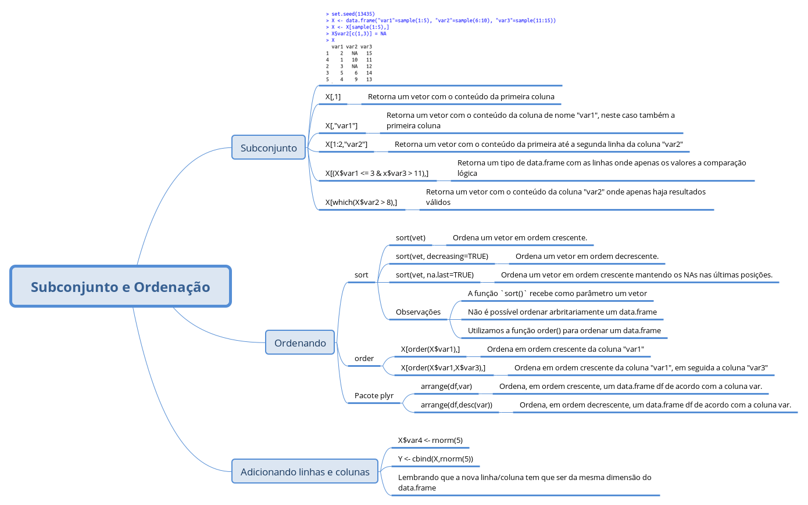
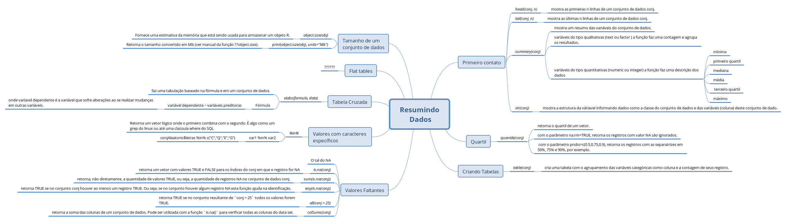

# Notas de Aula [Semana 3]

## Subconjuntos (subsettig)

### Rápida revisão.

Tendo o código

```r
set.seed(13435)
X <- data.frame("var1"=sample(1:5), "var2"=sample(6:10), "var3"=sample(11:15))
X <- X[sample(1:5),]
X$var2[c(1,3)] = NA
X
```

```r
  var1 var2 var3
1    2   NA   15
4    1   10   11
2    3   NA   12
3    5    6   14
5    4    9   13
```
Podemos extrair os seguintes subconjuntos

```r
```
```r
X[,1] # Um vetor com o conteúdo da primeira coluna
```
```r
X[,"var1"] # Um vetor com o conteúdo da coluna de nome "var1", neste caso também a primeira coluna
```
```r
X[1:2,"var2"] # Um vetor com o conteúdo da primeira até a segunda linha da coluna "var2"
```
```r
X[(X$var1 <= 3 & x$var3 > 11),] # Um tipo de data.frame com as linhas onde apenas os valores atendam
                                # a comparação lógica 
```
```r
X[which(X$var2 > 8),] # Um vetor com o conteúdo da coluna "var2" onde apenas haja resultados válidos
```
Sobre este último subconjunto, utilizamos a função `which()`. Esta função retorna o índice de um vetor em que o valor seja `TRUE`. Na coluna "var2" temos dois registros que são `NA`. Se fizermos apenas o `X$var2 > 8` teriamos o seguinte retorno:

```r
[1]    NA  TRUE    NA FALSE  TRUE
```
Desta forma, o resultado do subconjunto seria todas as linhas em que o resultado é TRUE (2 e 5) e NA para as linhas 1 e 3:
```r
X[X$var2 > 8,]
```

```r
     var1 var2 var3
NA     NA   NA   NA
4       1   10   11
NA.1   NA   NA   NA
5       4    9   13
```

Utilizando o comando `which()` os valores `NA` são ignorados trazendo apenas os índices dos resultados TRUE, ou seja, linhas 2 e 5.

## Ordenando

- `sort(vet)` - ordena um vetor em ordem crescente.
- `sort(vet, decreasing=TRUE)` - ordena um vetor em ordem decrescente.
- `sort(vet, na.last=TRUE)` - ordena um vetor em ordem crescente mantendo os NAs nas últimas posições.

A função `sort()` recebe como parâmetro um vetor, ou seja, não é possível ordenar arbritariamente um data.frame. Precisamos definir uma variável (coluna) em que o data.frame deverá ser ordenado. Utilizamos a função `order()` no subconjunto de um data.frame.

Com os exemplos anteriores:

```r
X[order(X$var1),] # ordena em ordem crescente da coluna "var1"
X[order(X$var1,X$var3),] # ordena em ordem crescente da coluna "var1", em seguida a coluna "var3"
```
### Ordenando com plyr

Pacote **plyr**

- `arrange(df,var)` - ordena, em ordem crescente, um data.frame df de acordo com a coluna var.
- `arrange(df,desc(var))` - ordena, em ordem decrescente, um data.frame df de acordo com a coluna var.

## Adicionando linhas e colunas

```r
X$var4 <- rnorm(5)  # adiciona, se não existir, uma coluna de nome "var4" e associa os valores retornados da função `rnorm(5)`
                    # lembrando que o retorno tem que ser da mesma dimensão das linhas do data.frame
```
```r
Y <- cbind(X,rnorm(5)) # adiciona à variável Y o conteúdo de X (df) e adiciona uma nova coluna com o valor do `rnorm(5)`
```

### Dicas do Peng

[Notas de Aulas de Andrew Jaffe](http://www.biostat.jhsph.edu/%7Eajaffe/lec_winterR/Lecture%202.pdf)



## Resumindo (summarizing) dados

Ao realizarmos o carregamento (load) de um conjunto de dados, proucuramos tirar resumos deles, ou seja, em definição não formal, agrupar dados em variáveis e aplicar estatísticas nestas amostragens.

Utilizaremos o mesmo [conjunto][1] de dados da aula do Coursera

### Olhando um pouco dos dados

O primeiro passo após carregar um conjunto de dados é fazer sua leitura (de visualização). Não seria prudente abrir um conjunto de dados completo, considerando que trabalharemos (tomara) com grandes *data sets*. 

Existem funções do R em que podemos ver uma pequena parte do início ou do fim do conjunto carregado.

- `head(conj, n)` - mostra as primeiras n linhas de um conjunto de dados conj.
- `tail(conj, n)` - mostra as últimas n linhas de um conjunto de dados conj.
- `summary(conj)` - mostra um resumo das [variáveis][2] do conjunto de dados.
    - variáveis do tipo qualitativas ( *text* ou *factor* ) a função faz uma contagem e agrupa os resultados.
    - variáveis do tipo quantitativas ( *numeric* ou *integer*) a função faz uma descrição dos dados (mínimo, primeiro quartil, mediana, média, terceiro quartil, máximo)
- str(conj) - mostra a estrutura da váriavel informando dados como a classe do conjunto de dados e das variáveis (coluna) deste conjunto de dado.

Exemplo de `summary`

```r
                           name         zipCode             neighborhood councilDistrict
 MCDONALD'S                  :   8   Min.   :-21226   Downtown    :128   Min.   : 1.00  
 POPEYES FAMOUS FRIED CHICKEN:   7   1st Qu.: 21202   Fells Point : 91   1st Qu.: 2.00  
 SUBWAY                      :   6   Median : 21218   Inner Harbor: 89   Median : 9.00  
 KENTUCKY FRIED CHICKEN      :   5   Mean   : 21185   Canton      : 81   Mean   : 7.19  
 BURGER KING                 :   4   3rd Qu.: 21226   Federal Hill: 42   3rd Qu.:11.00  
 DUNKIN DONUTS               :   4   Max.   : 21287   Mount Vernon: 33   Max.   :14.00  
 (Other)                     :1293                    (Other)     :863                  
      policeDistrict                        Location.1      
 SOUTHEASTERN:385    1101 RUSSELL ST\nBaltimore, MD\n:   9  
 CENTRAL     :288    201 PRATT ST\nBaltimore, MD\n   :   8  
 SOUTHERN    :213    2400 BOSTON ST\nBaltimore, MD\n :   8  
 NORTHERN    :157    300 LIGHT ST\nBaltimore, MD\n   :   5  
 NORTHEASTERN: 72    300 CHARLES ST\nBaltimore, MD\n :   4  
 EASTERN     : 67    301 LIGHT ST\nBaltimore, MD\n   :   4  
 (Other)     :145    (Other)                         :1289  
```

Exemplo de `str`

```r
'data.frame':	1327 obs. of  6 variables:
 $ name           : Factor w/ 1277 levels "#1 CHINESE KITCHEN",..: 9 3 992 1 2 4 5 6 7 8 ...
 $ zipCode        : int  21206 21231 21224 21211 21223 21218 21205 21211 21205 21231 ...
 $ neighborhood   : Factor w/ 173 levels "Abell","Arlington",..: 53 52 18 66 104 33 98 133 98 157 ...
 $ councilDistrict: int  2 1 1 14 9 14 13 7 13 1 ...
 $ policeDistrict : Factor w/ 9 levels "CENTRAL","EASTERN",..: 3 6 6 4 8 3 6 4 6 6 ...
 $ Location.1     : Factor w/ 1210 levels "1 BIDDLE ST\nBaltimore, MD\n",..: 835 334 554 755 492 537 505 530 507 569 ...
```

### Quartil de variáveis quantitativas

- `quantile(conj)` - retorna o [quartil][3] de um vetor.
    - com o parâmetro `na.rm=TRUE`, retorna os registros com valor NA são ignorados.
    - com o parâmetro `probs=c(0.5,0.75,0.9)`, retorna os registros com as separatrizes em 50%, 75% e 90%, por exemplo.

### Criando tabelas

- `table(conj)` - cria uma tabela com o agrupamento das variáveis categóricas como coluna e a contagem de seus registro.

Exemplo de `table`

```r
set.seed(1234)
conjAleatorio <- data.frame(
     "letras"=sample(x = LETTERS, size = 20, replace = TRUE),
     "numeros"=sample(x = 1:5, size = 20, replace = TRUE))
table(conjAleatorio$letras)
```

```r
A C E G H N O P Q R S V W Y 
1 1 1 3 3 1 1 1 3 1 1 1 1 1 
```

O mesmo pode ser feito se compararmos duas colunas da mesma tabela

```r
table(conjAleatorio$letras, conjAleatorio$numeros)
```
```r
    1 2 3 4 5
  A 0 0 1 0 0
  C 0 1 0 0 0
  E 0 0 0 0 1
  G 0 1 0 0 2
  H 1 2 0 0 0
  N 1 0 0 0 0
  O 0 1 0 0 0
  P 1 0 0 0 0
  Q 1 1 0 0 1
  R 0 0 0 0 1
  S 0 0 1 0 0
  V 0 0 0 1 0
  W 0 1 0 0 0
  Y 0 0 1 0 0
```
Veja que a combinação de resultados de G e 5, aparecem duas vezes:

```r
conjAleatorio[order(conjAleatorio$letras),]
   letras numeros
7       A       3
1       C       2
19      E       5
8       G       5 #<--
18      G       2
20      G       5 #<--
13      H       2
15      H       1
17      H       2
10      N       1
12      O       2
3       P       1
2       Q       2
4       Q       1
6       Q       5
9       R       5
11      S       3
16      V       4
5       W       2
14      Y       3
```

### Verificar se há valores faltantes

- `is.na(conj)` - retorna um vetor com valores TRUE e FALSE para os índices do conj em que o registro for NA.

Lembrando que TRUE equivale a 1 e FALSE equivale a 0, portanto em um conjunto de TRUEs e FALSEs se utilizarmos a função `sum` obteremos a quantidade de registros com valor TRUE.

- `sum(is.na(conj))` - retorna, não diretamente, a quantidade de valores TRUE, ou seja, a quantidade de registros NA no conjunto de dados conj.
- `any(is.na(conj))` - retorna TRUE se no conjunto conj houver ao menos um registro TRUE. Ou seja, se no conjunto houver algum registro NA esta função ajuda na identificação.
- `all(conj > 25)` - retorna TRUE se no conjunto resultante de `conj > 25` todos os valores forem TRUE.
- `colSums(conj)` - retorna a soma das colunas de um conjunto de dados. Pode ser utilizada com a função `is.na()` para verificar todas as colunas do data set.

### Valores com caracteres específicos

#### Operador `%in%`

Retorna um vetor lógico onde o primeiro combina com o segundo. É algo como um grep do linux ou até uma claúsula where do SQL:

```r
var1 %in% var2
```
Exemplo com conjunto acima:

```r
conjAleatorio$letras %in% c("C")
```
```r
 [1]  TRUE FALSE FALSE FALSE FALSE FALSE FALSE FALSE FALSE FALSE FALSE FALSE FALSE FALSE FALSE FALSE FALSE FALSE
[19] FALSE FALSE
```
... equivale a ...

```r
conjAleatorio[,1] == "C"
```
```r
 [1]  TRUE FALSE FALSE FALSE FALSE FALSE FALSE FALSE FALSE FALSE FALSE FALSE FALSE FALSE FALSE FALSE FALSE FALSE
[19] FALSE FALSE
```
O primeiro é bem mais intuítivo e tem maior utilidades para comparações maiores

```r
conjAleatorio$letras %in% c("C","Q","E","G")
```
```r
 [1]  TRUE  TRUE FALSE  TRUE FALSE  TRUE FALSE  TRUE FALSE FALSE FALSE FALSE FALSE FALSE FALSE FALSE FALSE  TRUE
[19]  TRUE  TRUE
```
Podemos aplicar a função `table` ao retorno do `%in%`.

```r
table(conjAleatorio$letras %in% c("C","Q","E","G"))
```
```r
FALSE  TRUE 
   12     8 
```

Agora pense, se o retorno da função %in% é um vetor lógico, podemos usá-lo para tirar amostras de uma população:

```r
conjAleatorio[conjAleatorio$letras %in% c("C","Q","E","G"),]
   letras numeros
```
```r
1       C       2
2       Q       2
4       Q       1
6       Q       5
8       G       5
18      G       2
19      E       5
20      G       5
```
### Cross tabs

Para [tabulação cruzada][4]usamos a função `xtabs` ( [uso da função][5] em português).

- `xtabs(formula, data)` - faz uma tabulação baseado na fórmula e em um conjunto de dados.

A tal da fórmula é *variável dependente ~ variáveis preditoras* (visto [aqui][5]), onde varíavel dependente é a variável que sofre alterações ao se realizar mudanças em outras variáveis. Veja a função do primeiro grau:

y = ax + b

A variável dependente é o y pois, sendo a e b constantes, para cada valor em x o valor de y irá alterar-se. Variáveis preditoras são as variáveis que alterarão a variável dependente. Para o exemplo acima, seria a variável x, ou seja, a variável independente.

Utilze [este exemplo][6]

```r
data(UCBAdmissions)
DF = as.data.frame(UCBAdmissions)
summary(DF)
```

Neste conjunto de dados temos as variáveis Admit, Gender, Dept e Freq. Dada a função:

```r
xt <- xtabs(Freq ~ Gender + Admit,data=DF)
```
Queremos uma tabela cruzada em que os valores a serem resumidos são os da coluna Freq e queremos relacioná-las entre Gender e Adimt. Ou seja, qual a frequência de admissão (...) por gênero aceitas e rejeitadas.

```r
xt
        Admit
Gender   Admitted Rejected
  Male       1198     1493
  Female      557     1278
```

### Flat tables

Necessita de maior esclarecimentos sobre o *flat table*

### Tamanho de um conjunto de dados

`object.size(obj)` - Fornece uma estimativa da memória que está sendo usada para armazenar um objeto R.
`print(object.size(obj), units="Mb")` - Retorna o tamanho convertido em Mb (ver manual da função `??object.size`).



## Criando novas variáveis

### Por quê criar novas variáveis?

- Frequentemente o dado bruto não terá o valor que você está proucurando.
- Você precisará transformar os dados para obter o valor desejado.
- Normalmente, você adicionará esses valores a um data.frame com os dados em que esteja trabalhando.
- Variáveis comuns:
    - Indicadores de falta.
    - Cortes de variáveis quantitativas (??)
    - *Applying transforms.*

### Criando sequências

- Útil para adicionar índices a conjuntos de dados
- `seq(from=a, to=b, by=c, length=d)` - cria uma sequência regular em um vetor de *a* até *b*, com uma razão de *c* tendo conjunto um tamanho *d*.
- `seq(along=conj)` - cria uma sequência regular em um vetor com o tamanho do conjunto.

### Subconjunto de variáveis

Utilizando o [mesmo][7] conjunto de dados das aulas anteriores podemos criar uma variável que indica quais os registros que tenham uma característica específica:

```r
restData$nearMe = restData$neighborhood %in% c("Roland Park", "Homeland")
table(restData$nearMe)
```
```r
FALSE  TRUE 
 1314    13 
```
### Criando variáveis binárias

## Vamos falar sobre Tidy Data.

Basicamente:

* Cada variavel forma uma coluna
* Cada observação forma uma linha
* Cada tipo de "unidade observacional" forma uma tabela.

### Funções (muito) úteis

* `gather()`:
* `separete()`:
* `spread()`:
* `unique()` 


[1]: https://github.com/DataScienceSpecialization/courses/blob/master/03_GettingData/03_02_summarizingData/index.md#getting-the-data-from-the-web
[2]: http://leg.ufpr.br/~silvia/CE055/node8.html
[3]: http://www.inf.ufsc.br/~marcelo.menezes.reis/AED05.pdf
[4]: http://www.unilago.com.br/download/arquivos/21034/Estatistica_Aplicada_-_Resumo_03.pdf
[5]: http://ecologia.ib.usp.br/bie5782/doku.php?id=bie5782:02_tutoriais:tutorial4:start#xtabs
[6]: https://github.com/DataScienceSpecialization/courses/blob/master/03_GettingData/03_02_summarizingData/index.md#cross-tabs
[7]: https://github.com/exata0mente/DataScienceCoursera/tree/master/3_GettingAndCleaningData/Semana3#resumindo-summarizing-dados