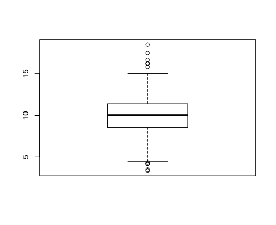
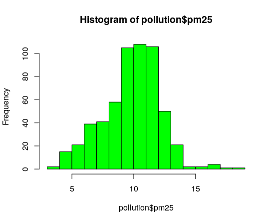
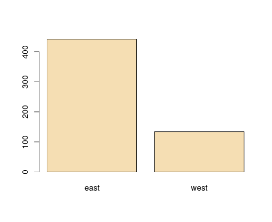

Aqui vou comentar os tipos de gráficos que podem ser usados para uma "primeira olhada" no conjunto de dados. 

A importância de se usar gráficos para analisar previamente um conjunto de dados é que podemos identificar já de início alguns padrões que possam nos guiar no decorrer da análise. Além disso, conforme Peng:

> In later stages of an analysis, graphics can be used to “debug” an analysis, if an unexpected (but not necessarily wrong) result occurs, or ultimately, to communicate your findings to others

## Resumos simples - Uma dimensão

### Resumo dos cinco números

É uma estatística descritiva que utiziliza cinco medidas para resumir um conjunto de dados *unidimensional*. São eles:

* O valor mínimo 
* O 25º percentil (tem cerca de 25% dos valores abaixo dele)
* A mediana (o valor "do meio")
* O 75º percentil (tem cerca de 75% dos valores abaixo dele)
* O valor máximo

A função `fivenum()` recebe um vetor de numérico e retorna um vetor de cinco posições com as estatísticas supracitadas.

É possível notar que a função `summary()` também traz estes dados porém com a adição da média (assim é possível comparar a média com a mediana identificando assimetria do conjunto de dados)

Uma boa referência em português: http://leg.ufpr.br/~fernandomayer/aulas/ce001n-2016-01/03_Medidas_resumo/03_Medidas_resumo.pdf

### Boxplot

O boxploth, [criado por John Tukey](http://vita.had.co.nz/papers/boxplots.pdf), é uma representação gráfica do resumo dos cinco números.

A parte inferior da caixa representa o primeiro quartil e a superior representa o terceiro quartil. A linha que divide horizontalmente a caixa é a mediana. Os "whiskers" inferior e superior são calculados da como LI (limite inferior) e LS (limite superior), onde

`LI = Q1 - 1.5 * (Q3 - Q1)`  
`LS = Q3 - 1.5 * (Q3 - Q1)`

O `(Q3 - Q1)` representa o intervalo interquartil.

Os pontos fora dos limites são os chamados *outliers*, que são pontos que estão muito distantes da distribuição do conjunto de dados.

No R utilizamos a função `boxplot()` para plotar este gráfico.

Referências:

https://oestatistico.com.br/boxplot-a-caixa-magica/  
http://www.portalaction.com.br/estatistica-basica/31-boxplot  
https://pt.wikipedia.org/wiki/Diagrama_de_caixa  

### Histograma

O gráfico histograma torna visual a distribuição completa do conjunto de dados. Assim conseguimos ver onde há mais concentração de dados e também identificar outliers.

Por exemplo, no gráfico abaixo é possível notar que a maior concentração de dados, ou melhor, os dados aparecem com maior frequência próximo do 10 (sobre o conjunto de dados utilizados, sugiro acompanhar pelo slide citado no cabeçalho ou no livro).

O histograma é criado através da função `hist()`.

### Gráfico de barras

O gráfico de barras é útil para comprarmos/resumirmos variáveis categoricas

## Resumo simples: Duas ou mais dimensões

Para duas dimensões os gráficos apresentados são muito úteis quando usados lado a lado. Por exemplo um gráfico de barras de vendas da região de Goiás ao lado de um mesmo gráfico só que da região do Rio Grande do Norte.

Há também o gráfico de dispersão (scatterplot) que é muito útil para se utilizar com duas [variáveis contínuas](http://leg.ufpr.br/~silvia/CE055/node8.html).

Recomenda-se o uso de cores para simular uma terceira dimensão. Também recomenda-se o uso de linhas (verticais ou horizontais) para demarcar alguma medida de referência (mediana por exemplo).